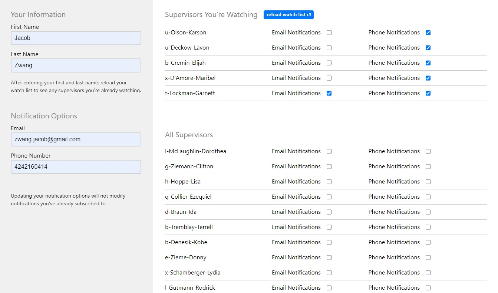

# Full Stack Engineer Coding Challenge



## Run Demo

First, clone this repository.

To run the frontend and backend, use docker compose and go to http://localhost:8080. Both the frontend and backend are run on the same comtainer. A Postgres database runs in it's own container.

```
docker compose up
```

## Todo

- Automated Testing
- Performence Enhancements to /api/supervisors query
- Mobile Optimization (currently is not practical on mobile)
- Save Your Infomation to local storage (or cookies if SSR is used)
- Success and loading toasts
